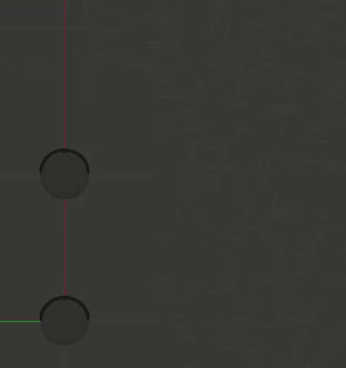

# avoi_dance
This project demonstrates two iRobot Create-3 robots autonomously navigating without collision using ROS2 and Gazebo. [Click here to view the video demo](https://youtu.be/UZLSEi7mFqk)

<p align="center">
  
</p>

## Implementation & Experimental Setup

### Overview

This project involves developing a control node designed to enable a robot to navigate autonomously within a specified perimeter while avoiding another robot. Both robots operate under the same control node, differentiated by unique namespaces and parameters.

The system's localization of the robots within the global frame relies exclusively on each robot's odometry data. However, a notable limitation of this approach is the gradual degradation of odometry accuracy over time, which compromises the system's ability to accurately predict and prevent collisions between the robots.

### Algorithm

The algorithm is based on the following steps:

<p align="center">
  
  <br>
  Algorithm High Level Diagram
</p>

The node subscribes to the odometry data of both robots and calculates the distance between them. If the distance is less than a specified threshold and the robot faces the other robot, the node publishes a command to the robots to steer away. If the robot is outside of the perimeter the node publishes a command to the robot to steer back inside the perimeter. Most of the time, the robots are commanded to randomly move around in the perimeter.

### Challenges & Possible Improvements

While working on the project, I encountered several challenges that present opportunities for future improvements:
* The robot docking station had to be removed because the docking and undocking actions are not yet functional in ROS2 Humble. This issue should be addressed in the future.
* In an attempt to control two robots simultaneously in an environment with obstacle (AWS small house), I tried to use infrared measurements (topic /ir_intensity) and bump detection (topic /hazard_detection). While these topics function as expected with a single robot in the simulation, issues arise when controlling two robots simultaneously. The precise cause is unclear, but an examination of the node graph (referenced below) reveals asymmetries, indicating discrepancies in the node graphs between the two robots. Resolving this issue is crucial for enabling the robots to adeptly maneuver through a map while avoiding obstacles (excluding the other robot, which remains detectable via the /odom topic).
* Autonomous behaviors in the behaviors_scheduler.hpp file had to be disabled because they were causing unwanted autonomous actions in the robots. This measure is a temporary fix, and the underlying issue needs to be investigated.
* To know the exact position of the robots, the /odom topic was used. Unfortunatly, the odometry data is not always accurate, and the robots' positions can drift over time. This issue can be addressed by using a more accurate localization system, such as SLAM or sensor fusion (with GPS sensor data for instance).

<p align="center">
  
  <br>
  Node Graph of the Systems
</p>

## Setup & Run Instructions

### Requirements
* [`ROS 2 Humble`](https://docs.ros.org/en/ros2_documentation/humble/) on `Ubuntu 22.04 LTS`
* [`Gazebo11`](https://classic.gazebosim.org/https://classic.gazebosim.org/)
* `Python >= 3.10`
* `C++ >= 17`
* Submodule [`aws-robomaker-small-house-world`](git@github.com:aws-robotics/aws-robomaker-small-house-world.git)
* Submodule [`create3_sim`](git@github.com:DJacquemont/create3_sim.git)

### Setup Instructions
* Create a workspace:
    ```bash
    $ cd ~
    $ mkdir -p create3_ws/src
    ```
* Clone the repo:
    ```bash
    $ cd ~/create3_ws/src
    $ git clone git@github.com:DJacquemont/avoi_dance.git .
    ```
* Setup the submodules:
    ```bash
    $ cd ~/create3_ws/src
    $ git submodule update --init --recursive
    ```

### Build and Run Instructions
* Build the workspace:
    ```bash
    $ cd ~/create3_ws
    $ colcon build
    ```
* Run the ROS2 packages and Gazebo simulation:
    ```bash
    $ cd ~/create3_ws
    $ source install/local_setup.bash
    $ ros2 launch avoi_dance avoi_dance.launch.py
    ```


